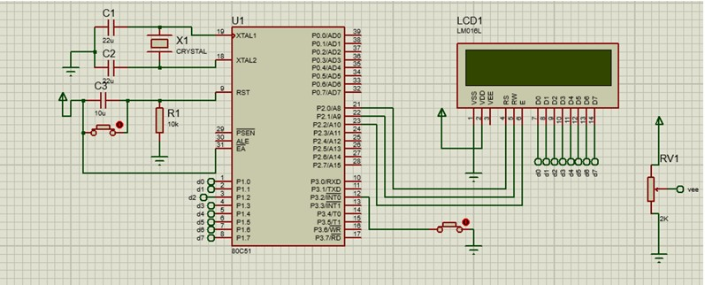

# 🎲 Digital Dice using 8051 Microcontroller

This project simulates a digital dice using an 8051 microcontroller. The dice rolls when a button is pressed and displays a random number (1–6) on a Liquid Crystal display.

---

##  Tools Used
- **Assembly Language** for 8051
- **Proteus** for circuit simulation
- **Keil uVision** (optional) for writing and compiling `.asm` code

---

##  Folder Structure
- CODE: Contains the 8051 assembly source code (`project.a51)
- SIMULATION: Proteus design file (`mpmc.pdsprj`) and screenshots of output
- REPORT: Project report with circuit diagram, explanation, and analysis - 'digital dice report.pdf'

---

## 🔧 How It Works
- A push-button simulates the dice roll.
- On each press, the microcontroller generates a pseudo-random number (1–6).
- The number is displayed on a single lcd display using port outputs.

---

## 🧪 Simulation
- Open `mpmc.pdsprj` in Proteus.
- Load the compiled hex file from the assembly code.
- Press the button to roll the dice — the result shows up on the display.

---

## 📌 Highlights
- Efficient use of minimal hardware: button + LCD display + 8051
- Demonstrates basic I/O handling, delay routines, and control logic in assembly
- Compact and fun simulation for learning microcontroller basics

